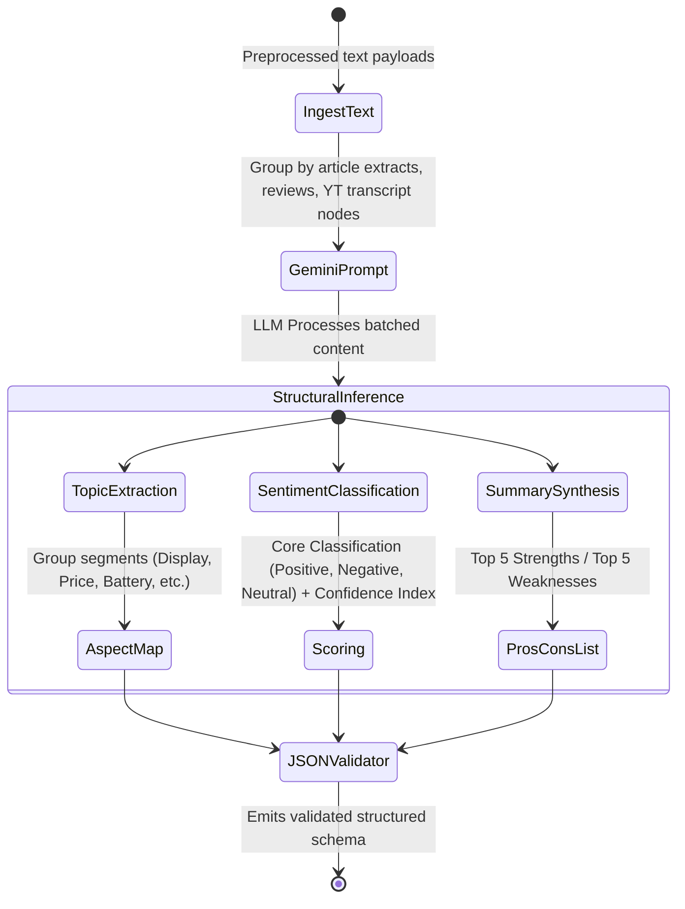
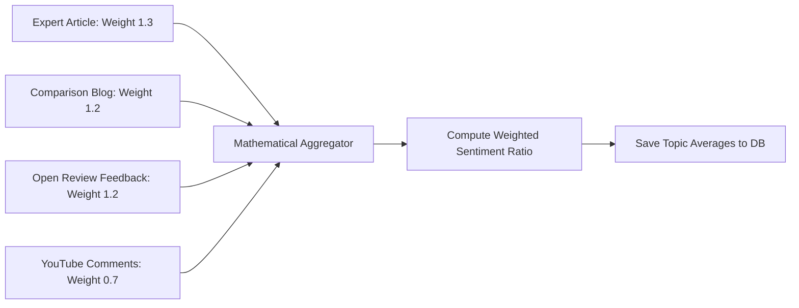
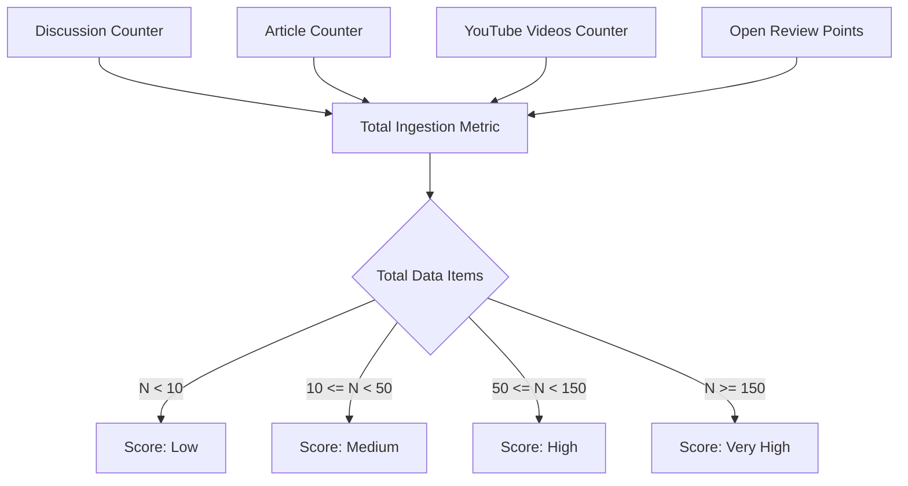

# Insights Product Analysis Pipeline Specification

This document details the complete end-to-end data ingestion, processing, analysis, and synthesis pipeline for the **Insights** platform. It describes how user search entries are processed in less than 10 seconds to produce structured, reliable purchase recommendations.

---

## 🗺️ High-Level Pipeline Flowchart

```mermaid
graph TD
    A[User Inputs Search Query] --> B{Product in DB & Fresh?}
    B -- Yes (< 24 hrs) --> C[Fetch Cached Details from Postgres]
    B -- No / Stale --> D[Trigger Multi-Source Collection Pipeline]
    
    %% Phase 1: Parallel Fetching
    D --> E1[Google Custom Search API]
    D --> E2[YouTube Data API]
    D --> E3[Open Review API]
    D --> E4[Wikipedia API]
    
    E1 -. Promise.allSettled() .-> F[Consolidated Raw Raw Data Ingestion Stream]
    E2 -. Promise.allSettled() .-> F
    E3 -. Promise.allSettled() .-> F
    E4 -. Promise.allSettled() .-> F
    
    %% Phase 2: Cleaning Layer
    F --> G[Data Cleaning & Deduplication Layer]
    G --> H[Spam & Quality Filtering]
    
    %% Phase 3: AI Inference Layer
    H --> I[Gemini AI Structural Core]
    I --> J1[Aspect-Based Sentiment Mining]
    I --> J2[Dynamic Topic Extraction]
    I --> J3[Synthesized Summarization Engine]
    
    %% Phase 4: Clustering & Scoring
    J1 --> K[Opinion Clustering & Target Classification]
    J2 --> K
    K --> L[Confidence Score Calculator]
    K --> M[Weighted Sentiment Averaging]
    
    %% Phase 5: Recommendation Synthesis
    L --> N[Recommendation Heuristics Engine]
    M --> N
    J3 --> N
    
    %% Phase 6: Sync & Return
    N --> O[Write Structs to Supabase Database]
    O --> P[Return Live Dashboards Response]
    C --> P
```

---

## 🔄 Detailed Phase-by-Phase Process Explanation

### Phase 1: Dynamic Search & Cache Validation
1. **User Request Intake**: A user types a search request (e.g., iPhone 15) on the home screen.
2. **Metadata Matching**: The system runs a search on existing `products` table columns (`brand`, `name`, `category`). 
3. **Staleness Bound check**:
   - If a matching product exists and its `updated_at` timestamp is newer than 24 hours, the server skips external ingestion entirely to optimize cost and API quotas.
   - If not found or stale ($> \text{24 hours}$ since update), or if `forceRefresh: true` is set, the ingestion pipeline triggers sequentially.

---

### Phase 2: Multi-Source Data Collection (Fault-Tolerant)
The server starts concurrent requests using `Promise.allSettled()`. This ensures that even if YouTube or Open Review fails (e.g., quota limits or API outages), the remaining sources continue processing without crashing the entire app.

```mermaid
sequenceDiagram
    autonumber
    participant Pipeline as Ingestion Engine
    participant GSearch as Google Custom Search API
    participant YT as YouTube Data API
    participant Wiki as Wikipedia API
    participant OR as Open Review API

    rect rgb(240, 240, 240)
        Note over Pipeline, OR: Parallel execution using Promise.allSettled()
        Pipeline->>GSearch: Fetch top 10 articles, reviews, comparison blogs
        Pipeline->>YT: Fetch video metadata & transcript snippets
        Pipeline->>Wiki: Fetch specification metadata & launch dates
        Pipeline->>OR: Fetch structured review ratings, dates, verified feedback
    end

    GSearch-->>Pipeline: Returns array of result snippets & URLs
    YT-->>Pipeline: Returns top relevant reviews (or rejects on Quota error)
    Wiki-->>Pipeline: Returns factual overview table
    OR-->>Pipeline: Returns array of user rating items

    Note over Pipeline: Gathers all resolved components; silences failures.
```

- **Wikipedia API Rules**: Leveraged strictly for factual details (release dates, manufacturer, dimensions). Factual inputs are kept separate from sentiment pipelines to eliminate subjective biases.
- **Open Review API Rules**: High-fidelity structured inputs parsed to map out star distribution data early.

---

### Phase 3: Ingestion Preprocessing (Data Cleaning & Deduplication)
Before processing content with LLMs (which increases token costs and adds noise), a lightweight Node.js/TypeScript preprocessing utility cleanses the input data stream:
1. **URL Deduplication**: Strips tracking parameters and removes overlapping link references returned from Google Search.
2. **Exact Content Deduplication**: Implements quick hash checks (MD5 or SHA-256) on raw text structures to drop duplicate blockquotes or cross-posted reviews.
3. **Plagiarism / Near-Duplicate Trimming**: Compares title sentences using Jaccard Similarity. If $\text{score} > 0.85$, only the source with the higher weight is retained.
4. **Spam & Noise Filtering**: Rejects short comment blocks ($< 15$ characters like "nice!", "cool"), elements with heavy tracking codes, or generic landing page terms.

---

### Phase 4: AI Sentiment Analysis & Structural Extraction (Gemini Core)
Cleaned text blocks are batched and presented to the Gemini API using structured JSON output prompts to guarantee consistent parse routines.



#### Expected Gemini JSON Payload Signature:
```json
{
  "opinions": [
    {
      "aspect": "Battery",
      "sentiment": "positive",
      "confidence": 0.95,
      "quote": "The battery easily lasts 2 full days under normal workloads."
    },
    {
      "aspect": "Price",
      "sentiment": "negative",
      "confidence": 0.88,
      "quote": "Slightly overpriced compared to last year's options."
    }
  ],
  "overall_summary": "An exceptional workhorse matching industry standards, though premium pricing is a major barrier.",
  "extracted_pros": ["Robust battery capacity", "Excellent build colorways", "Clear display output"],
  "extracted_cons": ["Higher price entry-point", "No bundled charger block"]
}
```

---

### Phase 5: Opinion Clustering & Weighted Aspect Aggregation
The backend consolidates separate evaluation items onto unified topics using a weight-factored mathematical model.



- **Target Clustering Formula**:
  $$\text{Aspect Sentiment Score} = \frac{\sum \left(\text{Individual Sentiment Value} \times \text{Source Weight} \times \text{AI Confidence}\right)}{\sum \left(\text{Source Weight} \times \text{AI Confidence}\right)}$$
  Where:
  - $\text{Positive} = +1.0$, $\text{Neutral} = 0.0$, $\text{Negative} = -1.0$.
  - Generates scores on a linear $[-1.0, +1.0]$ bounds scale.

---

### Phase 6: Confidence Index calculation
This metadata engine gauges the aggregate volume of facts compiled, defining how authentic and reliable the final assessment is.



---

### Phase 7: Recommendation Decision Engine
Determines the ultimate consumer signpost (**BUY**, **DEPENDS**, **AVOID**) based on hard logical branches rather than raw model speculation.

```mermaid
decide
    IF (Confidence is 'Low') OR (Source Pool < 5) -> Recommendation: DEPENDS (Reason: Insufficient Data pool)
    ELIF (Weighted Sentiment Score >= +0.4) AND (Cons < 3) -> Recommendation: BUY
    ELIF (Weighted Sentiment Score <= -0.2) OR (Negative Topic Mentions > 60%) -> Recommendation: AVOID
    ELSE -> Recommendation: DEPENDS
```

---

### Phase 8: Data Cache Ingestion & Response Delivery
1. The structured pipeline product graph writes concurrently into Supabase PostgreSQL target schemas in a single transaction.
2. The client fetches a highly-polished, responsive JSON dashboard model containing beautiful graphical mappings ready to be drawn by **Recharts** visualizations inside the layout layers.
