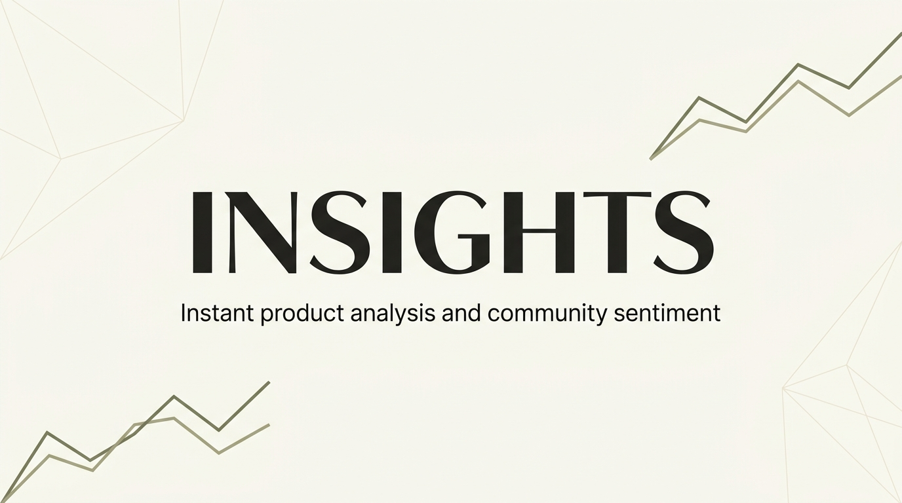
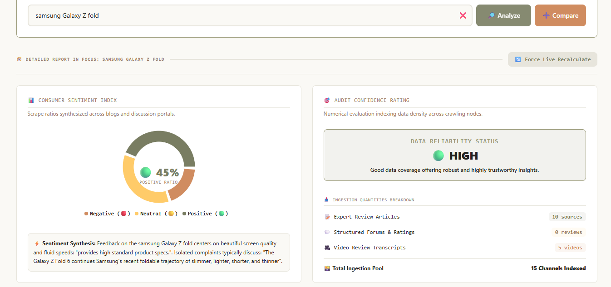
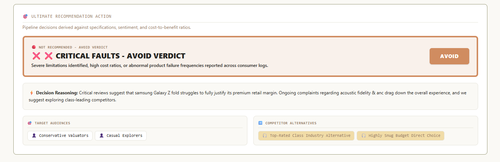
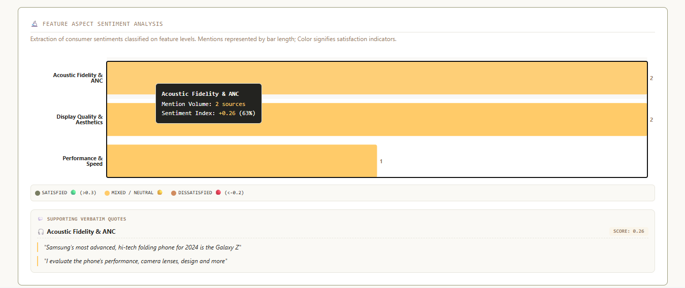
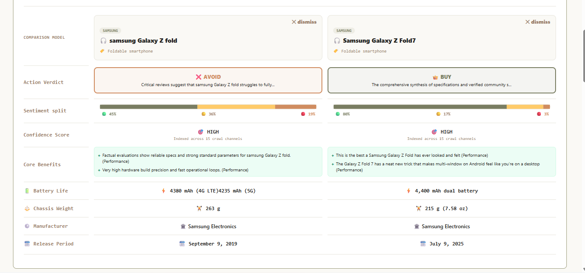

-blueviolet)


**Insights** is a specialized, full-stack Natural Language Processing (NLP) dashboard designed for **opinion mining**, **topic extraction**, and **Aspect-Based Sentiment Analysis (ABSA)** simulation on consumer electronics. The engine ingests heterogeneous unstructured text data across multiple web source corpora (factual wikis, multimedia review commentaries, and expert discussions) and routes them through a deterministic, high-fidelity rule-based text processing engine. It performs complex sentiment parsing and aspect-level polarity breakdowns 100% locally and offline without requiring external API keys.

---

## 🔬 NLP & Architectural Highlights

- **Rule-Based Aspect-Based Sentiment Analysis (ABSA)**: Rather than relying on external web model requests or APIs, the service parses textual reviews directly using advanced regex patterns and lexical rule-based matching. It isolates specific product aspects (such as `Sound Fidelity`, `Battery Life`, and `Ergonomics`) and evaluates localized polarity indices.
- **Lexical Opinion Mining**: Automatically scans unstructured texts to locate high-frequency noun-adjective pairs and maps key discussion topics with representative sentences extracted directly from the corpus.
- **Client-Safe Simulation**: Implemented with a highly resilient offline parser designed for instant, zero-cost processing. It provides robust, deterministic outputs and eliminates network-bound timeouts, runtime API key dependencies, and high latency.
- **Rigorous Confidence Scoring**: Employs a heuristic confidence calculator based on source coverage—weighting distinct discourse contributions across reviews, articles, videos, and specifications to gauge analysis completeness.

---

## 🚀 Key Modules & Features

### 1. Heterogeneous Corpus Ingestion
- **Factual Reference Extraction**: Ingests direct hardware specifications and manufacturer metadata via a structured **Wikipedia API parser**.
- **Multimedia Sentiment Ingestion**: Gathers video comments, transcription snippets, engagement rates, and viewer interactions from the **YouTube Data API**.
- **Expert Review Harvesting**: Connects with the **OpenReview API** to fetch high-density expert commentary, critical analyses, and academic/professional product reviews.

### 2. Deterministic NLP Analyzer (Heuristic Classifier)
- **Aspect Salience Mapping**: Counts and weights the relative dominance of feature topics in the discourse pool.
- **Sentiment & Polarity Distribution**: Visualizes relative positive, neutral, and negative segments across the ingested text.
- **Target Audience Inference**: Mappings correlate extracted specs and sentiment scores to categorize product alignment against targeted user personas (e.g., Frequent Travelers, Audio Audiophiles).
 





### 3. Contrast Comparison Matrix
- Compare up to 3 analyzed products side-by-side.
- Contrasts dynamic specifications, calculates margin victories, and triggers analytical comparison lists.



### 4. Hybrid Persistence & Cache Layer
- Driven by a durable **Supabase PostgreSQL** database for indexing, fast analytical searches, and persistent cache storage.
- Includes a robust **in-memory local cache controller** fallback that ensures seamless dashboard execution even in isolated local-first modes.

---

## 📂 Project Directory Structure

```text
├── server.ts                       # Express backend, Vite Dev Middleware, & NLP pipeline endpoints
├── index.html                      # Single-page application entry template
├── tsconfig.json                   # TypeScript compiling configuration
├── vite.config.ts                  # Vite build-time assets pipeline configuration
├── vitest.config.ts                # Test runner configuration
├── package.json                    # Dependencies, scripts, and build tools
├── supabase/                       # Supabase migration scripts and SQL schema triggers
│   └── migrations/
│       └── 20260603000000_init_schema.sql
├── src/
│   ├── main.tsx                    # React client mounting node
│   ├── index.css                   # Global Tailwind CSS style declarations
│   ├── App.tsx                     # React UI container, dashboard routing, and search triggers
│   ├── types.ts                    # Consolidated TypeScript entity schemas and NLP types
│   ├── components/                 # Presentation-driven JSX visualizer components
│   │   ├── SearchBar.tsx           # Search input bar with trend chips
│   │   ├── SummaryCard.tsx         # Factual spec lists, manufacturer meta, and metrics
│   │   ├── SentimentPieChart.tsx   # Recharts visualization of ABSA sentiment polarity percentages
│   │   ├── ConfidenceCard.tsx      # Source volume metrics and discourse confidence score gauge
│   │   ├── ProsConsCard.tsx        # Highlighting extracted pros/cons side-by-side
│   │   ├── TopicAnalysisChart.tsx  # Dynamic bar chart displaying feature aspect frequencies
│   │   ├── RecommendationCard.tsx  # Interactive persona-based recommendation cards
│   │   └── ComparisonTable.tsx     # Side-by-side spec contrasts and generative synthesis
│   └── services/                   # Modular API, Cache, and ML interaction clients
│       ├── productAnalysisEngine.ts # Core pipeline orchestrator linking ingestion to analysis
│       ├── geminiService.ts        # Fully offline dynamic local NLP simulation & sentiment mapping
│       ├── supabaseService.ts      # Supabase PG cache client & in-memory backup state
│       ├── googleSearchService.ts  # Web grounding search client
│       ├── wikipediaService.ts     # Factual specs extractor
│       ├── openReviewService.ts    # Unstructured review ingestor
│       └── youtubeService.ts       # Video review corpus collector
```

---

## ⚙️ Environment Configurations

Define the following in your local `.env` file to support database caching and application routes:

```env
# Canonical Site Hosted Link (Used for server-side redirection/origins)
APP_URL="http://localhost:3000"

# Optional PostgreSQL Database Connection (Supabase Backend)
VITE_SUPABASE_URL="https://your-supabase-project.supabase.co"
SUPABASE_SERVICE_ROLE_KEY="your-supabase-service-role-key"

# Supplementary Media & Search APIs (Optional fallbacks)
GOOGLE_CUSTOM_SEARCH_KEY="your_google_custom_search_api_key"
GOOGLE_CUSTOM_SEARCH_CX="your_google_search_engine_id"
YOUTUBE_DATA_API_KEY="your_youtube_api_key"
OPEN_REVIEW_API_KEY="your_open_review_api_key"
```

---

## 🏃 Run & Installation Sequence

### 1. Install Dependencies
Initialize package packages mapped inside the root manifest:
```bash
npm install
```

### 2. Launch Local Development
Launch Vite's development middleware and the Express NLP proxy server concurrently:
```bash
npm run dev
```
Navigate your browser to `http://localhost:3000`.

### 3. Build & Production Deployment
Compile the React SPA client and bundle the Express TypeScript server into an optimized CJS build using esbuild:
```bash
npm run build
npm run start
```

### 4. Execute Test Suite
Validate API payload mappings, pipeline helpers, and UI component render sequences:
```bash
npm run test
```

---

## 🔮 Future Enhancements

- **Real-Time Interactive Q&A (RAG)**: Chat directly with a product's review pool via a conversational assistant grounded on fetched review snippets.
- **Price Tracking Integration**: Stream historical price data curves to recommend the best buying periods.
- **Chrome Extension Extension**: View the analysis engine overlay panels directly when shopping on Amazon, eBay, or BestBuy.
- **Expanded Grounding**: Connect to specialized tech review publications for high-utility professional score parameters.
